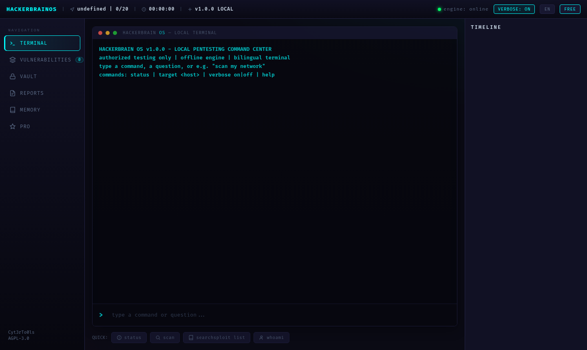
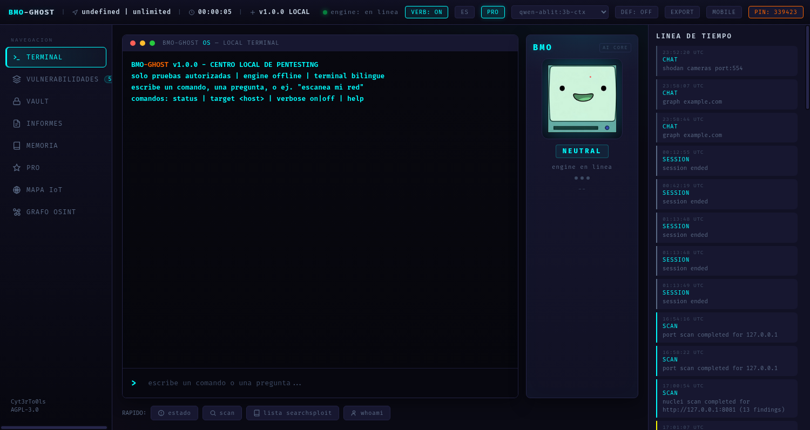
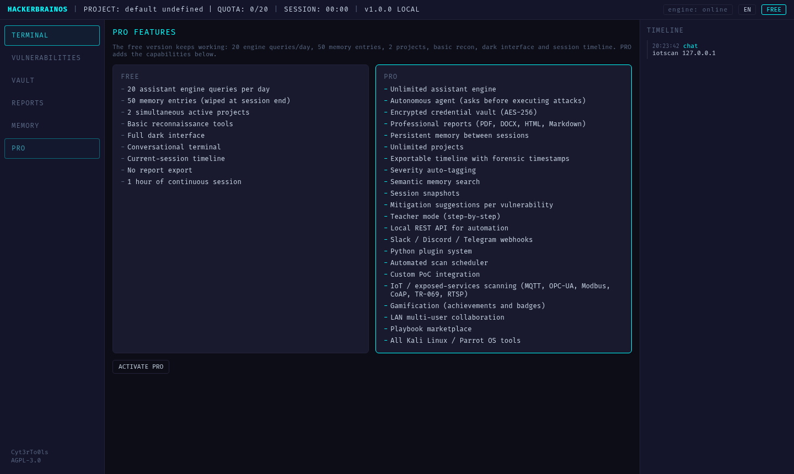
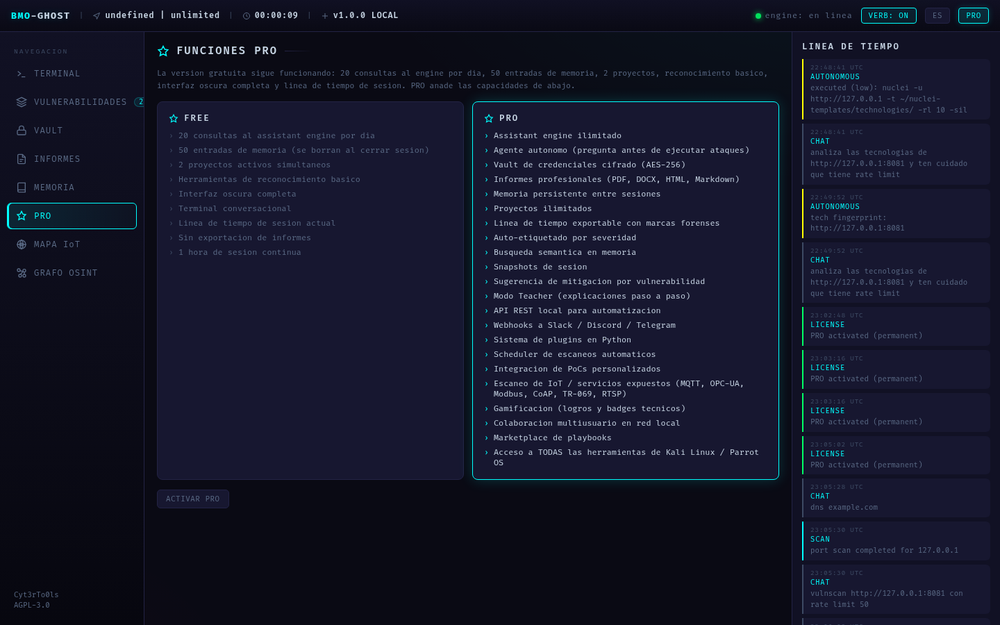
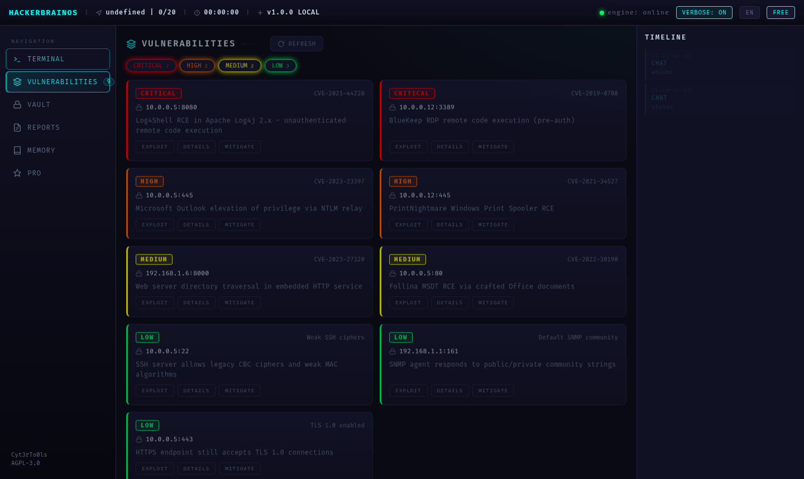
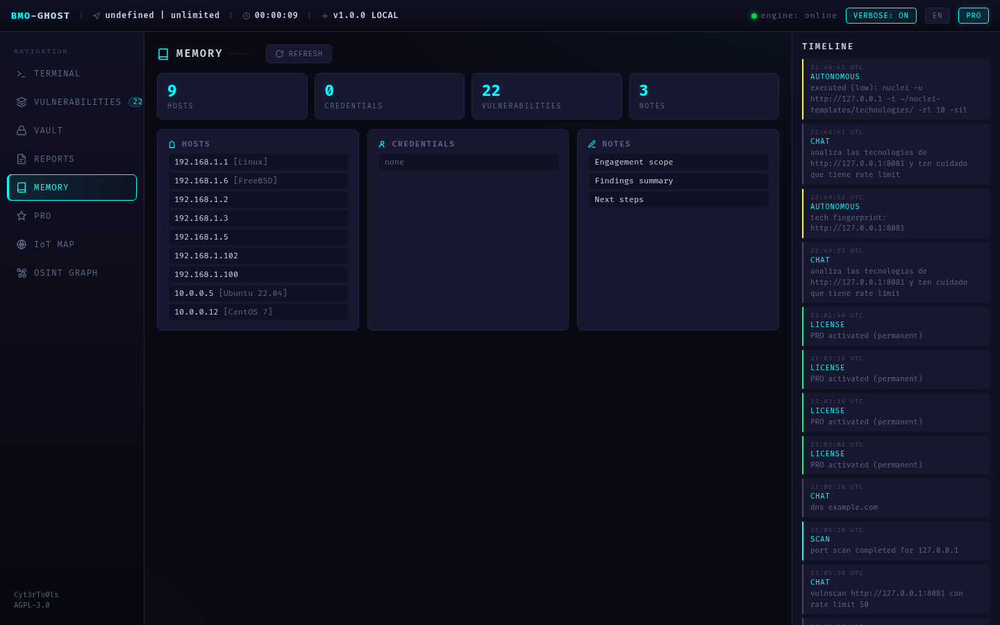

```
 _   _            _            _                _             ____   _____
| | | | __ _  ___| | _____  __| | ___ _ __   __| | ___ _ __  | __ ) / ____|
| |_| |/ _` |/ __| |/ / _ \/ _` |/ _ \ '_ \ / _` |/ _ \ '__| |  _ \| (___
|  _  | (_| | (__|   <  __/ (_| |  __/ | | | (_| |  __/ |    | |_) |\___ \
|_| |_|\__,_|\___|_|\_\___|\__,_|\___|_| |_|\__,_|\___|_|    |____/|_____/

        LOCAL PENTESTING COMMAND CENTER
```

Local pentesting assistant with autonomous attack capabilities for authorized
security testing. A sober, terminal-grade web interface that orchestrates the
standard Kali Linux / Parrot OS toolset on your own machine, backed by a local
assistant engine that analyzes output and proposes the next step.

Author: **Cyt3rTo0ls** - License: **AGPL-3.0**

---

## README LANGUAGE / IDIOMA

This repository is documented in two languages.
Este repositorio esta documentado en dos idiomas.

| English | Espanol |
| --- | --- |
| [README (English)](README.md) | [README (Espanol)](README_ES.md) |
| [TUTORIAL (English)](TUTORIAL.md) | [TUTORIAL (Espanol)](TUTORIAL_ES.md) |

---

## IMPORTANT: LOCAL APPLICATION - RESOURCE CONSUMPTION

HackerBrain OS is a **100% LOCAL, OFFLINE application**. Nothing runs in the
cloud and no data leaves your machine:

- The web UI, the assistant engine and every database (SQLite) run on your host.
- The assistant engine is a **local chat-completions API server** (a local
  model runner or a local wrapper) reachable at `localhost` (see
  `data/config.yaml` -> `engine`).
- **This consumes significant system resources.** Loading a local model and
  running inference uses heavy CPU, RAM and disk. A small 3B-parameter model
  typically needs several GB of RAM; larger models need much more. Long sessions
  keep the model warm in memory, which adds to steady-state usage.
- Plan your hardware before long engagements. If the engine is offline, the
  tool keeps working (tools, memory, vault, reports) without conversational
  analysis.
- Hardware note: the author's own machine does NOT run the assistant engine
  model. This project is aimed at users whose hardware CAN run a local model
  (a desktop/workstation with a capable CPU/GPU and enough RAM). The rest of
  the platform runs on any Kali/Parrot box; only the conversational engine
  needs the heavier hardware.

---

## LEGAL WARNING

> WARNING: This tool is intended for authorized security testing only.
> Unauthorized access to computer systems is illegal. The author assumes
> no liability for misuse of this software.

You are responsible for having written permission to test every target you
scan, enumerate or attack. Unauthorized scanning or exploitation is a crime
in most jurisdictions. Use this tool exclusively on systems you own or are
explicitly contracted to assess.

---

## SCREENSHOTS

Main dashboard (terminal view):



Dashboard in Spanish (`#es`):



PRO features view, visible from the free tier (sidebar -> PRO, or `#pro`):



PRO features view in Spanish:



Vulnerabilities view with severity filters:



Memory view with stats and stored entities:



---

## FEATURES

The free version shows the full PRO capability list in the interface
(sidebar -> PRO). Free users can always see what PRO unlocks.

### FREE (open source)

| Feature | Free |
| --- | --- |
| Assistant engine queries | 20 per day |
| Memory entries | 50 (wiped at session end) |
| Active projects | 2 |
| Report export | No |
| Session length | 1 hour |
| Recon tools | Basic |
| Dark professional interface | Yes |
| Conversational terminal | Yes |
| Current-session timeline | Yes |

### PRO (key activation)

| Feature | PRO |
| --- | --- |
| Assistant engine | Unlimited |
| Autonomous agent (asks before executing attacks) | Yes |
| Encrypted credential vault (AES-256) | Yes |
| Professional reports (PDF / DOCX / HTML / Markdown) | Yes |
| Persistent memory across sessions | Yes |
| Unlimited projects | Yes |
| Exportable timeline with forensic timestamps | Yes |
| Severity auto-tagging | Yes |
| Semantic memory search | Yes |
| Session snapshots | Yes |
| Mitigation suggestions per finding | Yes |
| Teacher mode (step-by-step) | Yes |
| Local REST API for automation | Yes |
| Slack / Discord / Telegram webhooks | Yes |
| Python plugin system | Yes |
| Scheduled scan scheduler | Yes |
| Custom PoC integration | Yes |
| Gamification (technical achievements) | Yes |
| LAN multi-user collaboration | Yes |
| Playbook marketplace | Yes |
| All Kali Linux / Parrot OS tools | Yes |
| IoT / exposed-services scanning (MQTT, OPC-UA, Modbus, CoAP, TR-069, RTSP) | Yes |

---

## INSTALLATION

Requirements: Python 3.10+ on Kali Linux 2024.1+ (or any Linux with the
security toolset). ~2 GB free disk for dependencies; the assistant engine
adds several GB depending on the model.

```bash
git clone https://github.com/Cyt3rTo0ls/hackerbrain-os.git
cd hackerbrain-os
./install.sh
```

`install.sh` verifies Python, creates a virtualenv, installs dependencies,
creates the folder structure, initializes the SQLite database, sets file
permissions and checks for a local assistant engine.

### Start the application

```bash
source .venv/bin/activate
uvicorn app:app --host 127.0.0.1 --port 8000
```

Open `http://127.0.0.1:8000` in your browser.

### Configure the local assistant engine

Edit `data/config.yaml`:

```yaml
engine:
  url: "http://127.0.0.1:8080"     # your local chat-completions endpoint
  fallback_ports: [8010, 8011, 11434]
```

HackerBrain OS probes the main URL, then the fallback ports. If no engine is
reachable, tools, memory, vault and reports still work; conversational
analysis is skipped. Remember: the engine runs locally and consumes
significant CPU/RAM.

---

## USAGE

Full step-by-step guides: [TUTORIAL.md](TUTORIAL.md) (English) and
[TUTORIAL_ES.md](TUTORIAL_ES.md) (Espanol). The interface includes a
language selector (EN/ES) in the status bar, a verbose mode toggle that
shows how long the assistant engine is thinking for each step, and the
free tier can browse all PRO capabilities from the sidebar (PRO view).

The terminal prompt (`>`) accepts both commands and questions.

- Type a tool command directly: `nmap -sV -T4 192.168.1.0/24`
- Use the scan helpers: `scan <target>`, `vulnscan <target>`, `iotscan <target>`, `recon <target>`
- Ask questions in plain language (English or Spanish): the assistant engine
  analyzes previous output and suggests the next step.
- Set a working target: `target 10.10.10.1`
- `status` shows engine connectivity, quotas and detected tools.

### Autonomous pentest / bug-bounty mode

Ask for an engagement in plain language and the agent plans and executes it
locally, step by step:

```text
> enumerate subdomains of example.com
> fuzz directories on example.com
> scan for vulnerabilities on 10.10.10.1
> haz reconocimiento a 10.10.10.1
> analiza los headers de https://example.com
```

For each step the engine chooses the tool and command, the agent executes it
locally, the engine analyzes the output and decides the next step (up to 3
steps per request). **High-risk actions (exploitation, brute force, etc.) are
never executed without explicit confirmation**: the agent proposes the
command and waits for your `yes` / `no` before running it. This matches the
PRO autonomous-agent behavior described in the features table.

Memory panel tracks hosts, credentials, vulnerabilities and notes. The
timeline panel records every event with timestamps.

---

## PRO ACTIVATION

1. Send **35 USDT** (one-time, permanent) to the TON wallet:
   `UQCznm2Z1o56J51EfNSnO922mzOQRhOF3m_o5T9Qx8WhK4w9`
2. Contact **@Cyt3rTo0ls** on Telegram.
3. Send a screenshot of the payment.
4. Receive a 6-digit activation key.
5. Enter the key in the application (PRO activation modal, top bar).

The key is validated locally against a mathematical relation; invalid keys
produce a generic rejection. PRO state is stored per local session.

A Telegram bot (`bot_handler.py`) is included for purchase support:

```bash
export TELEGRAM_BOT_TOKEN="your-bot-token"
export TELEGRAM_OWNER_ID="your-telegram-id"
python3 bot_handler.py
```

Commands: `/start`, `/buy`, `/activate`, `/key` (owner only).

---

## PLUGINS

Place Python plugins in `plugins/`. Each plugin exposes a `register(hb)` hook
receiving the HackerBrain API (`hb.executor`, `hb.memory`, `hb.vault`,
`hb.report`, `hb.agent`). Plugins are loaded at startup when PRO is active.

```python
# plugins/example_plugin.py
def register(hb):
    def my_action(target):
        return hb.executor.execute("nmap -sV " + target)
    hb.register_command("myaction", my_action)
```

Playbooks (reusable scan sequences, YAML/JSON) go in `playbooks/`.

---

## PROJECT STRUCTURE

```
hackerbrain-os/
├── app.py                 # FastAPI application (UI, WebSocket, REST, key middleware)
├── key_validator.py       # public key validation entry point
├── bot_handler.py         # Telegram support bot
├── install.sh             # installer
├── sales_page.html        # purchase / activation page
├── requirements.txt
├── core/
│   ├── agent.py           # orchestrator
│   ├── assistant_client.py# local engine client (chat-completions)
│   ├── tools_executor.py  # tool detection + safe execution
│   ├── scanner.py         # nmap / nuclei wrappers
│   ├── memory.py          # SQLite memory + FTS5 + AES-256 credentials
│   ├── vault.py           # AES-256 credential vault (PBKDF2)
│   ├── report_generator.py# PDF / DOCX / HTML / Markdown reports
│   ├── timeline.py        # event timeline
│   └── key_validator.py   # 6-digit key validation logic
├── ui/
│   ├── dashboard.html
│   └── assets/ (style.css, app.js, terminal.js)
├── data/
│   └── config.yaml        # engine, limits, payment, security config
├── images/                # interface screenshots (EN/ES)
├── plugins/               # Python plugins (PRO)
├── playbooks/             # playbook definitions
├── TUTORIAL.md            # installation and usage guide (English)
└── TUTORIAL_ES.md         # guia de instalacion y uso (Espanol)
```

---

## CONTRIBUTION

Pull requests are welcome. Keep the code sober, commented in technical
English, and emoji-free. Follow the existing structure. Security researchers
with responsible-disclosure experience are preferred.

---

## LICENSE

AGPL-3.0. See `LICENSE`. This software is provided "as is", without warranty
of any kind. You are responsible for using it legally.

---

## CONTACT

Telegram: **@Cyt3rTo0ls**
Wallet (TON / USDT): `UQCznm2Z1o56J51EfNSnO922mzOQRhOF3m_o5T9Qx8WhK4w9`
Price: **35 USDT** one-time, permanent.

WARNING: This tool is intended for authorized security testing only.
Unauthorized access to computer systems is illegal.
